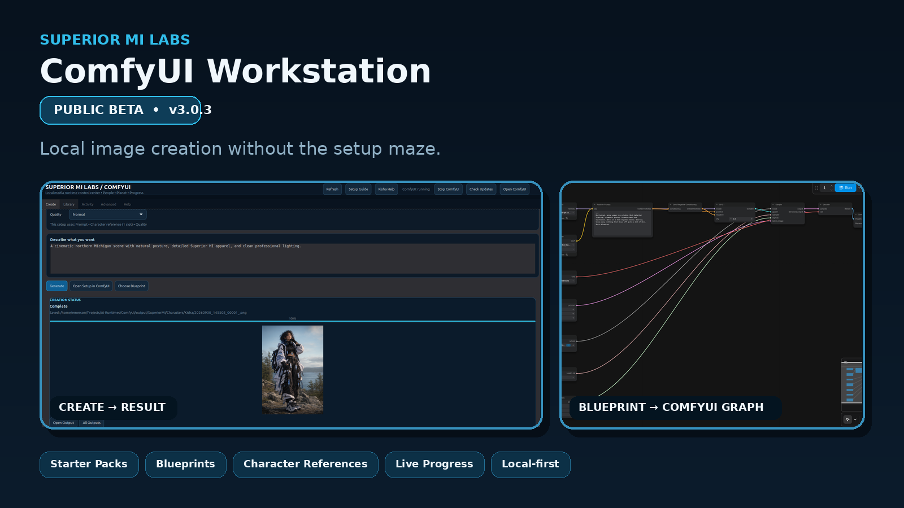
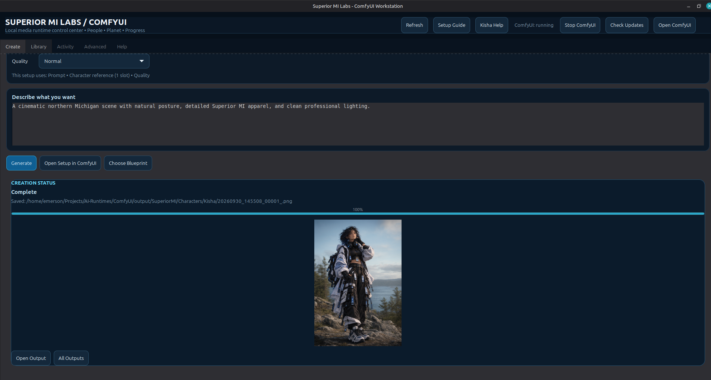
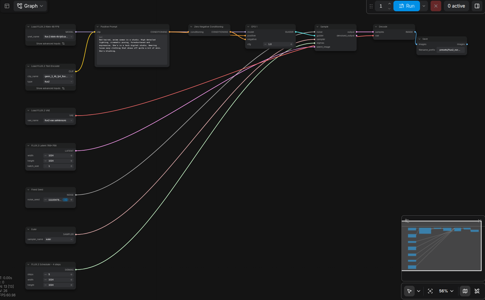
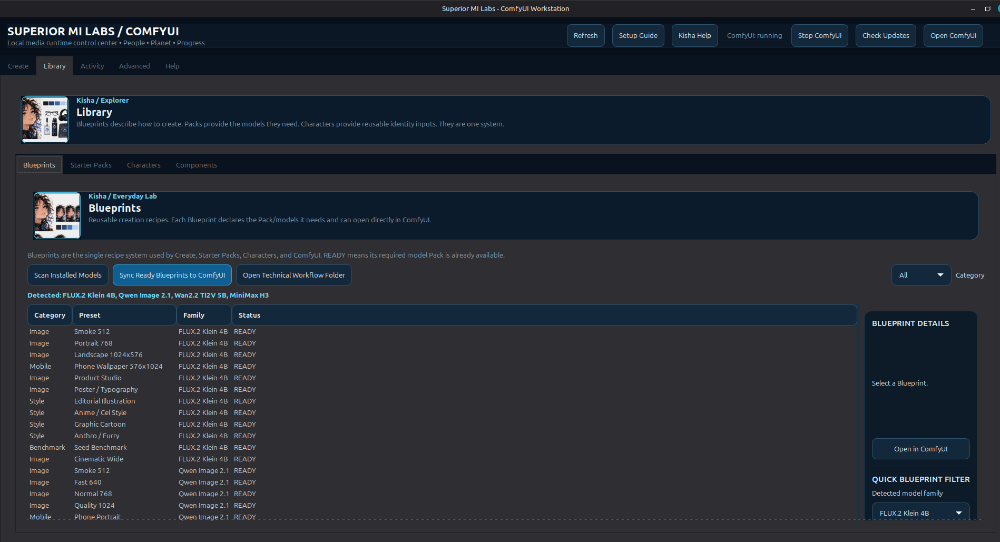
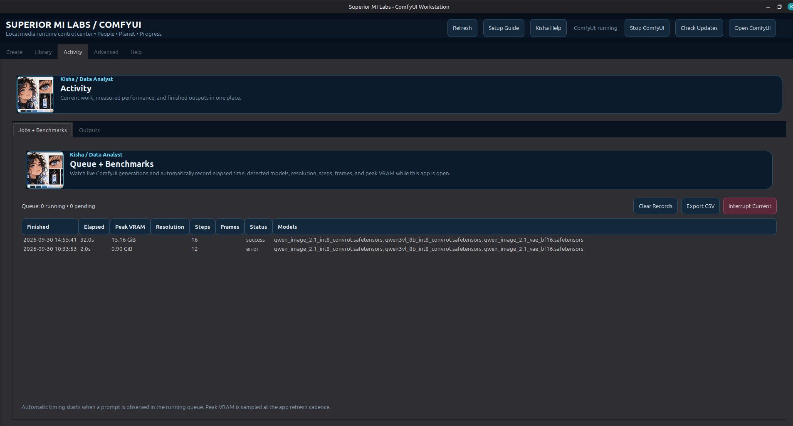
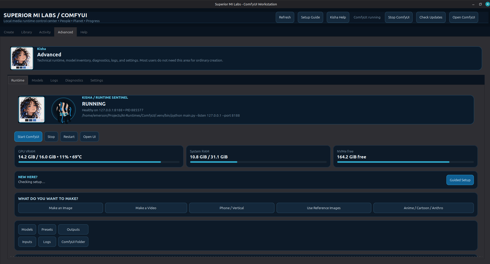

# Superior MI Labs / ComfyUI Workstation

> **Public Beta • v3.0.3**
>
> The GUI, Blueprint browser, presets, and templates are still evolving. A major visual and workflow-library overhaul is planned. The current beta is already intended to make installing ComfyUI, selecting local model stacks, and getting to a working image-generation setup much easier.



## What this is

Superior MI Labs / ComfyUI Workstation is a local-first desktop control center for ComfyUI.

It keeps ComfyUI as the canonical execution engine and adds a simpler layer for people who do not want to manually solve every model path, dependency, graph, reference-image input, and runtime setup before they can create something.

The Workstation is organized around four concepts:

- **Blueprints** are reusable creation recipes that translate into real ComfyUI graphs.
- **Starter Packs** install the model families and components a Blueprint needs.
- **Reference inputs** let compatible workflows use one or more ordinary images without introducing a domain-specific library.
- **Create** configures a Blueprint, validates it against the running ComfyUI node contract, queues it, tracks progress, and surfaces the output.

## Public beta highlights

- Guided ComfyUI setup and runtime controls.
- Beginner-friendly **Create** page for local image and image-to-video workflows.
- Graph-aware controls: irrelevant options are hidden when a selected Blueprint cannot use them.
- Qwen Image 2.1 reference-guided generation and editing.
- FLUX.2 Klein image generation.
- Wan2.2 TI2V image-to-video support.
- Multi-reference Qwen Image workflows with graph-derived controls.
- Starter Packs and curated Components.
- Live generation progress, elapsed time, output preview, and benchmark history.
- One-click **Open in ComfyUI** workflow handoff.
- Built-in update checking and development-source sync.
- Crash recovery, Safe Mode, diagnostics, and staged startup logging.
- Local model files stay local. The Workstation does not replace ComfyUI with a proprietary rendering pipeline.

## From simple controls to the real graph

The point is not to hide ComfyUI forever. It is to remove the setup barrier.

| Workstation | ComfyUI |
|---|---|
|  |  |

A Blueprint selected or configured in the Workstation becomes a normal ComfyUI graph that advanced users can inspect and edit.

## More screenshots

### Blueprint library



### Activity and benchmarks



### Runtime and diagnostics



### Example local output


## Install

### Current public beta

Linux Mint / Ubuntu / Debian-family systems are the current supported target.

Download the `.deb` from the **v3.0.3-beta.1** GitHub release, then:

```bash
cd ~/Downloads
sudo apt install ./Superior-MI-Labs-ComfyUI-Workstation_3.0.3_all.deb
```

Launch from the application menu or:

```bash
smi-comfyui
```

Diagnostics:

```bash
smi-comfyui --diagnose
```

Safe Mode:

```bash
smi-comfyui --safe
```

## Current beta status

This is a **public beta**, not the finished UI.

The next major design pass is expected to focus on:

- a substantially cleaner and more visual GUI;
- a more visual Blueprint/template browser;
- clearer Starter Pack recommendations and dependency information;
- richer workflow previews;
- stronger first-run guidance;
- Windows and macOS platform adapters;
- additional image, video, audio, and future model-family integrations.

The underlying direction is stable: one Blueprint system, one model/component authority, graph-derived inputs, and ComfyUI as the execution graph/runtime.

## Known expectations

- The current release is Linux-first.
- Model downloads can be large. The Workstation is designed to detect existing model files and avoid unnecessary duplicate copies.
- Some upstream model repositories have their own licenses, access rules, or hardware requirements.
- ComfyUI moves quickly. The Workstation validates generated prompts against the running `/object_info` node contract before queueing to catch API drift earlier.
- Public beta users should expect UI and Blueprint-library changes between releases.

## Verified beta qualification

WolfCat qualification for 3.0.3 completed with:

- successful application startup;
- successful Qwen Image 2.1 reference-guided generation;
- output preview inside Create;
- Blueprint-to-ComfyUI graph handoff;
- 22/22 automated Workstation tests passing;
- Python compile, shell syntax, JSON, ZIP, and Debian package checks passing.

Test hardware used during current qualification includes an NVIDIA RTX 3080 Laptop GPU with 16 GB VRAM.

## Project structure

```text
Create
  ↓
Blueprint
  ├── Pack / model dependencies
  ├── optional reference or source media
  ↓
runtime contract validation
  ↓
ComfyUI graph
  ↓
generation + progress + output
```

See [ARCHITECTURE.md](ARCHITECTURE.md), [docs/WORKSTATION-CORE-R1-PLAN.md](docs/WORKSTATION-CORE-R1-PLAN.md), and [PORTABILITY.md](PORTABILITY.md) for deeper design notes.

## Checksums

Release assets should match the checksums published in `update.json` and the GitHub release notes.

## Feedback

This beta is being released specifically to find real-world usability problems before the large GUI/Blueprint overhaul.

Useful reports include:

- what was confusing;
- which setup did not work;
- which model or workflow you expected to see;
- hardware and OS;
- screenshots or logs from `~/.cache/superior-mi-comfyui-workstation/`.

People should not need to become ComfyUI graph experts just to get a local image model running. The Workstation is intended to make the first mile much shorter while keeping the full graph available when you want it.

---

**Superior MI Labs**  
People • Planet • Progress
